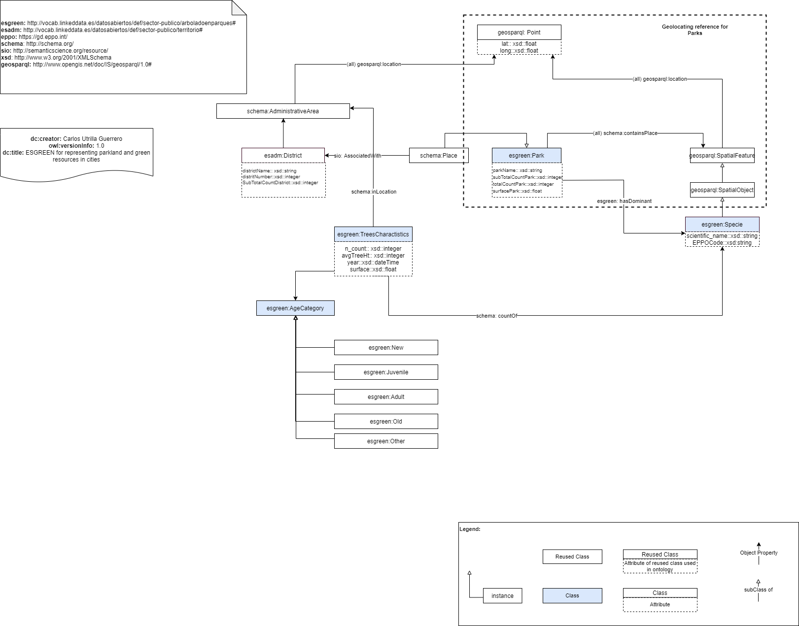

# esgreen-ontology
🌲 An OWL ontology to represent elements (trees) in green spaces (parkland, green areas and district) of the city that are relevant for Open City Project. 

---

## Diagram in png:

+ [Version Simple](Information/diagram-simple.png): Simple version of representation of the data.
+ [Version Complex](Information/diagram-complex.png): Complex version of representation of the data.

## Ontology versions - Steps:

### [esgreen-ontology Draft 1.0](Ontologies/esgreen-ontology.owl)

* 1. Make an ontology diagram using the [Version Simple]() with [diagrams.net](https://www.diagrams.net/) following a set of recommendations for ontology diagrams representation from [Chowlk Ontology Visual Notation](https://chowlk.linkeddata.es/chowlk_spec).
* 2. Automatically generated with `RDF file` with [Chowlk](https://chowlk.linkeddata.es/).
* 3. Use [WIDOCO](https://github.com/dgarijo/Widoco) to generate documentation.

### [esgreen-ontology Draft 2.0](Ontologies/esgreen-ontology-modified-protege.owl)

* 1. Insert `esgreen-ontology Draft 1.0` version in [Protege software](https://protege.stanford.edu/).
* 2. Make necessary changes to create `rdf` file.
* 3. Create a documentation using from the `rdf` file of `ii`.

---

[Documentation](https://carlosug.github.io/greencity-ontology/main/docs/lode/index-en.html)

[Visualisation](http://www.visualdataweb.de/webvowl/#iri=https://raw.githubusercontent.com/carlosug/greencity-ontology/main/Ontologies/esgreen-ontology.owl)

---
