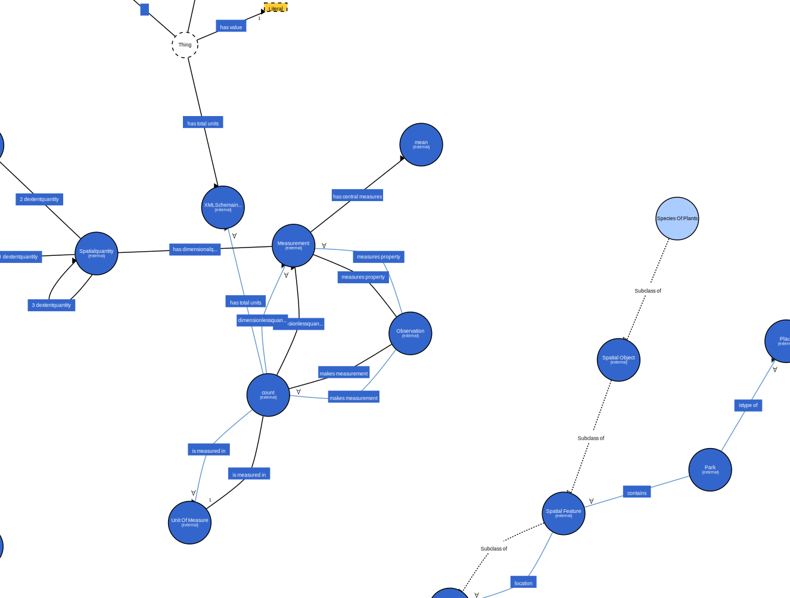
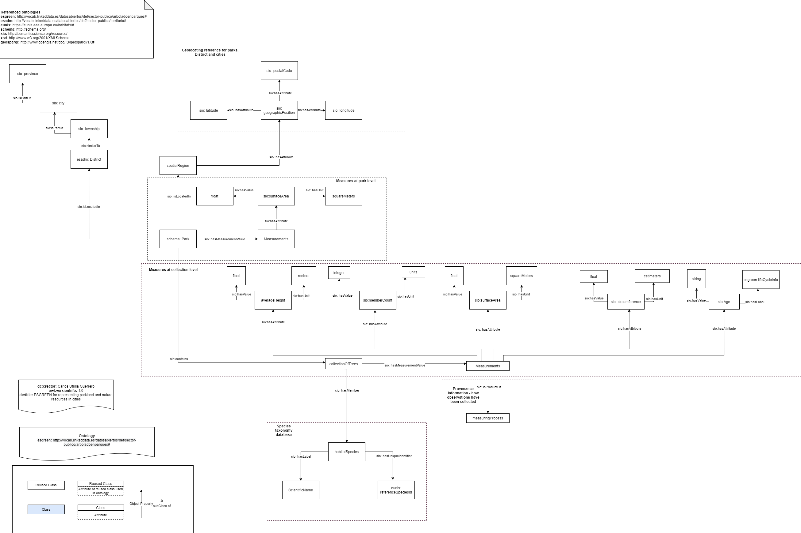

# Knowledge Graph for Open Government Data
🌲 A RDF knowledge graph for green spaces infrastructure (trees, parkland, green areas) data of a city that are relevant for [Open City Project](https://github.com/CiudadesAbiertas). 

---

## Research questions
* 1. **city center** most abundant organisms.
* 2. **outside** city center.
* 3. **areas** with least and most diverse species  diversity (Shannon Index).


### Inputs:
A total of 18 datasets originally from [Madrid Green Data Space](https://mgds.oeg.fi.upm.es/datasets.html) are used to generate the Ontology. These datasets consist of measures (e.g., number of trees) and dimensions describing the measures (e.g., regions)

- [Datasets](data/madrid)
- [General standards and description of all datasets](Information/data-standards.md)


## Documentation

### Install locally

Install dependencies:

```bash
yarn global add @rmlio/yarrrml-parser
wget https://github.com/RMLio/rmlmapper-java/releases/download/v4.12.0/rmlmapper.jar
pip install cow-csvw
```

### Run RML mapper

```powershell
cd etl
.\run.ps1
```
### Run CoW

* Export the dataset as csv

* Generate the metadata file with CSVw mappings:

```powershell
cow_tool build data/esgreen.csv
```
Run the CSVw mappings to generate RDF:

```powershell
cow_tool convert data/esgreen.csv
```

## Outputs

### Serialization Turtle syntax:

- [One per each dataset](Information/data-standards.md)

* [Documentation](https://carlosug.github.io/greencity-ontology/main/docs/lode/index-en.html)

* [Visualisation](http://www.visualdataweb.de/webvowl/#iri=https://raw.githubusercontent.com/carlosug/greencity-ontology/main/Ontologies/esgreen-ontology.owl)




### Diagram in png:

+ [Version Simple](Information/diagram-simple.png): Simple version of representation of the data.
+ [Version Complex](Information/diagram-complex.png): Complex version of representation of the data.
+ [Version Complex 2.0](Information/diagram-complex2.png): **Last version** of representation of the data reusing [sio](https://bioportal.bioontology.org/ontologies/SIO/) ontology entities, classes and properties.



---
## License

**Copyright (C) 2021, CLARIAH-PLUS WP1: CP-21-F-I 5**

MIT License 

---
