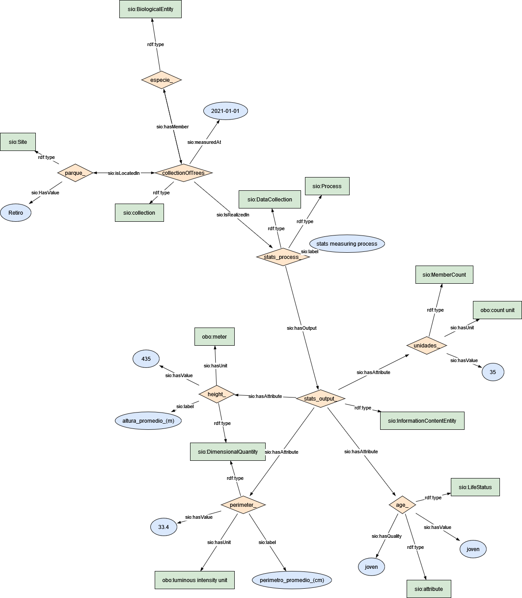

### Semantic model figure

This module describes the data elements related to tree inventory dataset.


<p align="center">
    <a href="../images/arbolado_3.png" target="_blank">
        
    </a>
</p>

***

### Example RDF (turtle):

```ttl

@prefix : <http://purl.org/ejp-rd/cde/v020/example-rdf/> .
@prefix obo: <http://purl.obolibrary.org/obo/> . 
@prefix sio: <http://semanticscience.org/resource/> .
@prefix xsd: <http://www.w3.org/2001/XMLSchema#> .
@prefix dc: <http://purl.org/dc/elements/1.1/> .
@prefix wiki: <http://en.wikipedia.org/wiki/> .
@prefix gbif: <https://www.gbif.org/species/> .
@prefix esgreen: <https://w3id.org/esgreen/> .


:parque_ a sio:Site ;
    sio:HasValue "Retiro"^^xsd:string ;
    sio:contains  :collectionOfTrees .
    # sio:hasMember :especie_name ;
    # sio:hasAttribute :geo_ .

:collectionOfTrees a sio:collection ;
    sio:IsRealizedIn :stats_process_ ;
    sio:isLocatedIn :parque_ ;
    sio:hasMember :especie_ ;
    sio:measuredAt "2021"^^xsd:date .

:stats_process_ a sio:Process ;
    sio:label "stats measuring process"^^xsd:string ;
    sio:hasOutput :stats_output_ .


:especie_ a sio:BiologicalEntity ;
    sio:isPartOf :collectionOfTrees .


:stats_output_ a sio:InformationContentEntity ;
    sio:hasAttribute :unidades_ ;
    sio:hasAttribute :age_ ;
    sio:hasAttribute :perimeter_ ;
    sio:hasAttribute :height_ .

:unidades_ a sio:MemberCount ;
    sio:hasValue "35"^^xsd:integer ;
    sio:hasUnit obo:UO_0000189 .

:age_ a sio:LifeStatus ;
    sio:hasQuality "joven" ;
    sio:hasValue "joven"^^xsd:string .

:perimeter_ a sio:DimensionalQuantity ;
    sio:label "perimetro_promedio_(cm)"^^xsd:string ;
    sio:hasValue "33.4"^^xsd:float ;
    sio:hasUnit obo:UO_0000007 .

:height_ a sio:DimensionalQuantity ;
    sio:label "altura_promedio_(m)"^^xsd:string ;
    sio:hasValue "435"^^xsd:integer ;
    sio:hasUnit obo:UO_0000008 .


```

***

### Data Description
    
  
| Original variable name           | New variable name | Description                                                  | Type   | Use                            | SIO Term | Other Term |
| -------------------------------- | ----------------- | ------------------------------------------------------------ | ------ | ------------------------------ | ------- | ---------- |
| PARQUE                           | park_name         | The unique name of the park on which tree is located         | ``string`` | To locate the tree             |   |  |
| Altura Promedio (m)              | avgTreeHt         | Average height (m) of all trees in a Park. Calculated as distance from ground level to three top | `int`    | for growth curve or change     | | |
| Perimetro Promedio (cm)          | avgTreePerim      | Average circumference of all trees in a Park. Diameter * Pi  | ``int``    | Phenology/allometric equations | | |
| Recién Plantado y no consolidado | n_ageNew          | Number of trees which age is 1 to 5 years                    | ``int``    | Phenology/allometric equations | | |
| Joven                            | n_ageJuvenile     | Num of trees in juvenile stage                               | `int`    |                                | | |
| Maduro                           | n_ageAdult        | Num of trees Achieved max. Optimal development               | `int`    |                                | | |
| Viejo                            | n_ageOld          | Num of trees deprecated age stage                            | `int`    |                                | | |
| Otros                            | n_others          | Number of trees death and others                             | `int`    |                                | | |
| Total General                    | subTotalCountPark | Total amount of trees in each park within a city             | `int`    | To count/agg per district      | | |
| Total                            | totalCountPark    | Total amount of tree in all parks within a city              | `int`    | To count/agg the whole city    | | |


### Mapping:
[Python Script](https://github.com/carlosug/opengov-kg/blob/main/etl/generate_rdf3.py)
### Output:
[RDF File](https://github.com/carlosug/opengov-kg/blob/main/etl/outputs/rdflib-output3.ttl)

### CHALLENGES AND TODO:
* Data cleaning: remove latin character and others _(*&(&#))_, unnecessary rows as total and aggregate values. [see data-cleaning.py](https://github.com/carlosug/opengov-kg/blob/main/etl/data-cleaning.py)
* All entities uses SIO schema but **specie** is not clear yet.
* The issue will be to map each entity with global identifier within biodiversity database (e.g. wikidata API such https://www.wikidata.org/w/api.php?action=wbsearchentities&search=pinus&language=en or https://www.gbif.org/species/2684241). [see data-argumentation.py](https://github.com/carlosug/opengov-kg/blob/main/etl/data-argumentation.py)
* Inconsistency file and variable names and therefore harmonization of the entity names.
* **Data Argumentation with georeferencing parks and taxo, family and other related terms from scientificname.** [see unique-species.py](https://github.com/carlosug/opengov-kg/blob/main/etl/unique-species.py)
