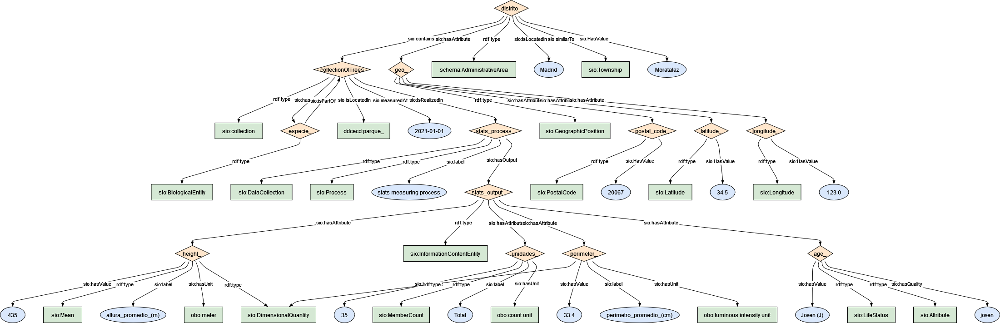

### Semantic model figure

This module describes the data elements related to [tree inventory dataset](https://github.com/carlosug/opengov-kg/blob/main/etl/data/inputs/preprocessing). It covers the ESGREEN level of Estado Zonas Verdes Distritos y Calles. The data specification can be found on the Open Data Madrid Platform at this [link](https://datos.madrid.es/FWProjects/egob/Catalogo/MedioAmbiente/ZonasVerdes/Ficheros/Informaci%C3%B3n%20de%20estado%20del%20arbolado%20en%20parques%20hist%C3%B3ricos%20singulares%20y%20forestales%20en%202019.pdf).


<p align="center">
    <a href="../images/arbolado_4.png" target="_blank">
        
    </a>
</p>

***

### Example RDF (turtle):

```ttl

@prefix : <http://purl.org/ejp-rd/cde/v020/example-rdf/> .
@prefix obo: <http://purl.obolibrary.org/obo/> . 
@prefix sio: <http://semanticscience.org/resource/> .
@prefix xsd: <http://www.w3.org/2001/XMLSchema#> .
@prefix dc: <http://purl.org/dc/elements/1.1/> .
@prefix wiki: <http://en.wikipedia.org/wiki/> .
@prefix gbif: <https://www.gbif.org/species/> .
@prefix esgreen: <https://w3id.org/esgreen/> .
@prefix schema: <http://schema.org/> .

:distrito_ a schema:AdministrativeArea ;
    sio:similarTo sio:Township ;
    sio:isLocatedIn "Madrid"^^xsd:string ;
    sio:HasValue "Moratalaz"^^xsd:string ;
    sio:contains :collectionOfTrees ;
    # sio:collection  :collectionOfEspecies ;
    # sio:contains :especie ;
    # sio:hasMember :especie_name ;
    sio:hasAttribute :geo_ .


# geolocation for district
:geo_ a sio:GeographicPosition ;
    sio:hasAttribute :latitude_ ;
    sio:hasAttribute :longitude_ ;
    sio:hasAttribute :postal_code_ .

:latitude_ a sio:Latitude ;
    sio:HasValue "34.5"^^xsd:float .

:longitude_ a sio:Longitude ;    
    sio:HasValue "123"^^xsd:float .
    
:postal_code_ a sio:PostalCode ;
    sio:HasValue "20067"^^xsd:integer .

:collectionOfTrees a sio:collection ;
    sio:IsRealizedIn :stats_process_ ;
    sio:isLocatedIn :parque_ ;
    sio:hasMember :especie_ ;
    sio:measuredAt "2021"^^xsd:date .

:stats_process_ a sio:Process, sio:DataCollection ;
    sio:label "stats measuring process"^^xsd:string ;
    sio:hasOutput :stats_output_ .


:especie_ a sio:BiologicalEntity ;
    sio:isPartOf :collectionOfTrees .


:stats_output_ a sio:InformationContentEntity ;
    sio:hasAttribute :unidades_ ;
    sio:hasAttribute :age_ ;
    sio:hasAttribute :perimeter_ ;
    sio:hasAttribute :height_ .

:unidades_ a sio:MemberCount ;
    sio:label "Total"^^xsd:string ;
    sio:hasValue "35"^^xsd:integer ;
    sio:hasUnit obo:UO_0000189 .

:age_ a sio:LifeStatus, sio:Attribute ;
    sio:hasQuality "joven" ;
    sio:hasValue "Joven (J)"^^xsd:string .

:perimeter_ a sio:DimensionalQuantity ;
    sio:label "perimetro_promedio_(cm)"^^xsd:string ;
    sio:hasValue "33.4"^^xsd:float ;
    sio:hasUnit obo:UO_0000007 .

:height_ a sio:DimensionalQuantity, sio:Mean ;
    sio:label "altura_promedio_(m)"^^xsd:string ;
    sio:hasValue "435"^^xsd:integer ;
    sio:hasUnit obo:UO_0000008 .

```

***

### Data Description
  
| Original variable name                   | New variable name     | Description                                                  | Type   | Use                            |
| ---------------------------------------- | --------------------- | ------------------------------------------------------------ | ------ | ------------------------------ |
| NOMBRE DISTRITO                          | area_name             | Name of the area/district on which tree is located           | `string` | To locate the park             |
| Num_DISTRITO                             | area_code             | The unique ID name of the park on which tree is located      | `int`    |                                |
| Recién Plantado y no consolidado (RPyNC) | n_ageNew              | Number of trees which age is 1 to 5 years                    | `int`    | Phenology/allometric equations |
| Altura Media (Hmedia)_RRLyNC             | avgTreeHt_New         |                                                              |        |                                |
| Joven (J)                                | n_ageJuvenile         | Num of trees in juvenile stage                               | `int`    |                                |
| Hmedia_J                                 | avgTreeHt_Juvenile    | Average height of all J trees in a Park. Calculated as distance from ground level to three top (m) | `int`    | for growth curve or change     |
| Maduro (M)                               | n_ageAdult            | Num of trees Achieved max. Optimal development               | `int`    |                                |
| Hmedia_M                                 | avgTreeHt_Adult       | Average height of all M trees in a Park. Calculated as distance from ground level to three top | `int`    | for growth curve or change     |
| Viejo (V)                                | n_ageOld              | Num of trees deprecated age stage                            | `int`    |                                |
| HMedia_V                                 | avgTreeHt_Juvenile    | Average height of all J trees in a Park. Calculated as distance from ground level to three top | `int`    | for growth curve or change     |
| Otros                                    | n_others              | Number of trees death and others                             | `int`    |                                |
| Hmedia_O                                 | avgTreeHt_Others      | Average height of all O trees in a Park. Calculated as distance from ground level to three top | `int`    | for growth curve or change     |
| Total General                            | subTotalCountDistrict | Total amount of trees in each district within a city         | `int`    | To count/agg per district      |


### Mapping:
[Python Script](https://github.com/carlosug/opengov-kg/blob/main/etl/generate_rdf4.py)
### Output:
[RDF File](https://github.com/carlosug/opengov-kg/blob/main/etl/outputs/rdflib-output4.ttl)

### CHALLENGES AND TODO:
* Average has cts and mts so python mapping script has function to take it into account.
