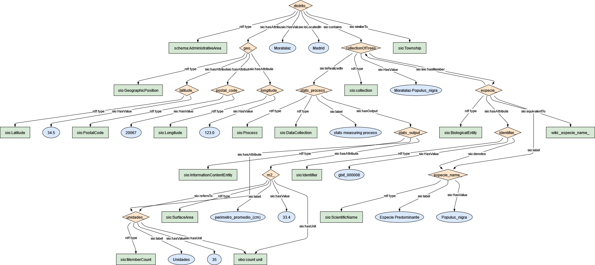

### Semantic model figure

This module describes the data elements related to tree inventory dataset.

<p align="center">
    <a href="../images/arbolado_6.png" target="_blank">
        
    </a>
</p>

***

### Example RDF (turtle):

```ttl
@prefix : <http://purl.org/ejp-rd/cde/v020/example-rdf/> .
@prefix obo: <http://purl.obolibrary.org/obo/> . 
@prefix sio: <http://semanticscience.org/resource/> .
@prefix xsd: <http://www.w3.org/2001/XMLSchema#> .
@prefix dc: <http://purl.org/dc/elements/1.1/> .
@prefix wiki: <http://en.wikipedia.org/wiki/> .
@prefix schema: <http://schema.org/> .


:distrito_ a schema:AdministrativeArea ;
    sio:similarTo sio:Township ;
    sio:isLocatedIn "Madrid"^^xsd:string ;
    sio:HasValue "Moratalaz"^^xsd:string ;
    sio:contains :collectionOfTrees ;
    # sio:collection  :collectionOfEspecies ;
    # sio:contains :especie ;
    # sio:hasMember :especie_name ;
    sio:hasAttribute :geo_ .


# geolocation for district
:geo_ a sio:GeographicPosition ;
    sio:hasAttribute :latitude_ ;
    sio:hasAttribute :longitude_ ;
    sio:hasAttribute :postal_code_ .

:latitude_ a sio:Latitude ;
    sio:HasValue "34.5"^^xsd:float .

:longitude_ a sio:Longitude ;    
    sio:HasValue "123"^^xsd:float .
    
:postal_code_ a sio:PostalCode ;
    sio:HasValue "20067"^^xsd:integer .

:collectionOfTrees a sio:collection ;
    sio:HasValue "Moratalaz-Populus_nigra"^^xsd:string ;
    sio:IsRealizedIn :stats_process_ ;
    sio:hasMember :especie_ .

:especie_ a sio:BiologicalEntity ;
# :especie a sio:Object .
    sio:hasAttribute :identifier_ ;
    sio:label :especie_name_ ;
    sio:equivalentTo wiki:_especie_name_ ;
    sio:isPartOf :CollectionOfTrees .

:identifier_ a sio:Identifier;
    sio:denotes :especie_name_ ;
    sio:HasValue "gbif_000008"^^xsd:string .

:especie_name_ a sio:ScientificName ;
    sio:label "Especie Predominante"^^xsd:string ;
    sio:HasValue "Populus_nigra"^^xsd:string .


:stats_process_ a sio:Process ;
    sio:label "stats measuring process"^^xsd:string ;
    sio:hasOutput :stats_output_ .


:stats_output_ a sio:InformationContentEntity ;
    sio:hasAttribute :unidades_ ;
    sio:hasAttribute :m2_ .

:unidades_ a sio:MemberCount ;
    sio:label "Unidades"^^xsd:string ;
    sio:hasValue "35"^^xsd:integer ;
    sio:hasUnit obo:UO_0000189 .

:m2_ a sio:SurfaceArea ;
    sio:label "perimetro_promedio_(cm)"^^xsd:string ;
    sio:hasValue "33.4"^^xsd:float ;
    sio:hasUnit obo:UO_0000189 ;
    sio:refersTo :unidades_ .
```

***

### Data Description
  
| Original variable name       | New variable name | Description                                                  | Type   | Use                |
| ---------------------------- | ----------------- | ------------------------------------------------------------ | ------ | ------------------ |
| Nombre_distrito              | district_name     | The unique name of the district on which tree is located     | `string` | To locate the tree |
| Num_distrito                 | district_name     | The unique ID number of the district on which tree is located | `string` | To locate the tree |
| NOMBRE_ESPECIE               | scientific_name   | Botanical name for the dominant specie                       | `string` | To group by taxon  |
| Unidades YEAR                | count             | Number of tree from same type                                | `int`    | To count/sum       |
| SUPERFICIE OCUPADA (m2)      | SurfaceArea       | Estimated using density of each mass of all trees in each district within a city (m2) | `float`  |                    |
| Superficie (ha)              | Surface           | Calculated area equal to a squared 100 m sides (h)           | `float`  |                    |
| Superficie TOTAL Parque (ha) | surfacePark (h)   | Surface of the total park                                    | `float`  |                    |


### Mapping:
[Python Script](https://github.com/carlosug/opengov-kg/blob/main/etl/generate_rdf6.py)
### Output:
[RDF File](https://github.com/carlosug/opengov-kg/blob/main/etl/outputs/rdflib-output6.ttl)

### CHALLENGES AND TODO:
* Remove unnecessary rows as total, num district and aggregate values.
* 2017 has to be converted into csv file.
* All entities uses SIO schema but the issue will be to map each entity with global identifier within biodiversity database (e.g. wikidata API such https://www.wikidata.org/w/api.php?action=wbsearchentities&search=pinus&language=en or https://www.gbif.org/species/2684241).
* Still data has to be cleaned e.g. extra text in some rows, even if character latin has been removed previously.
* Inconsistency file and variable names.
* Georeferencing still has to happen.
* District a Spatial region or Site SIO class.
